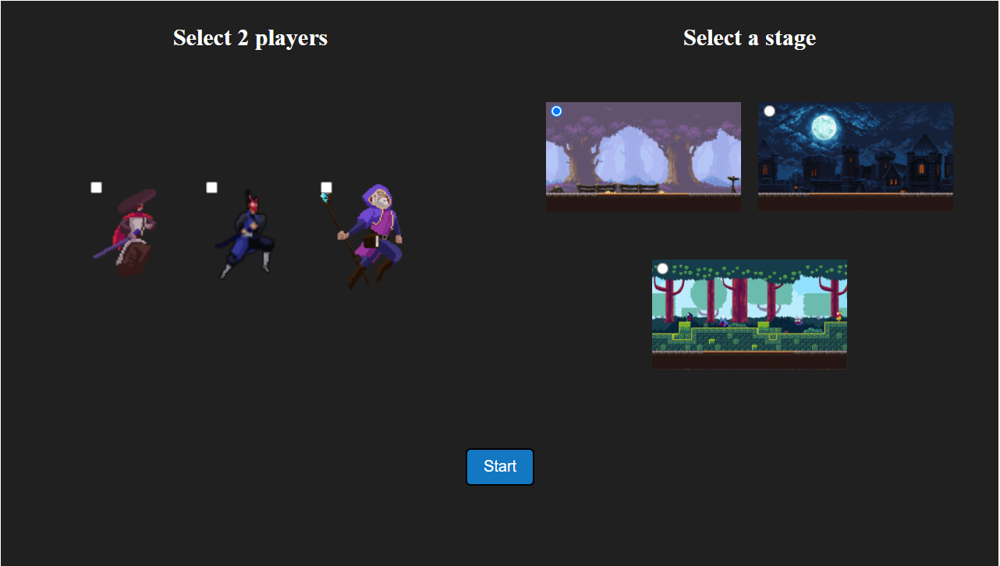
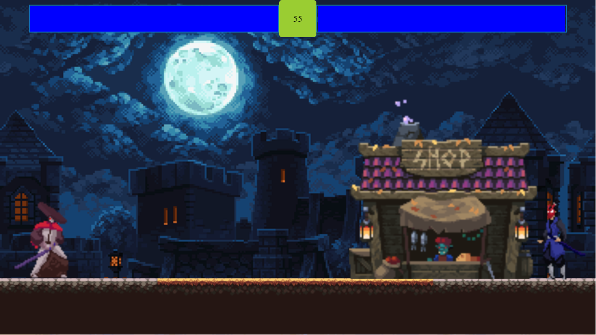
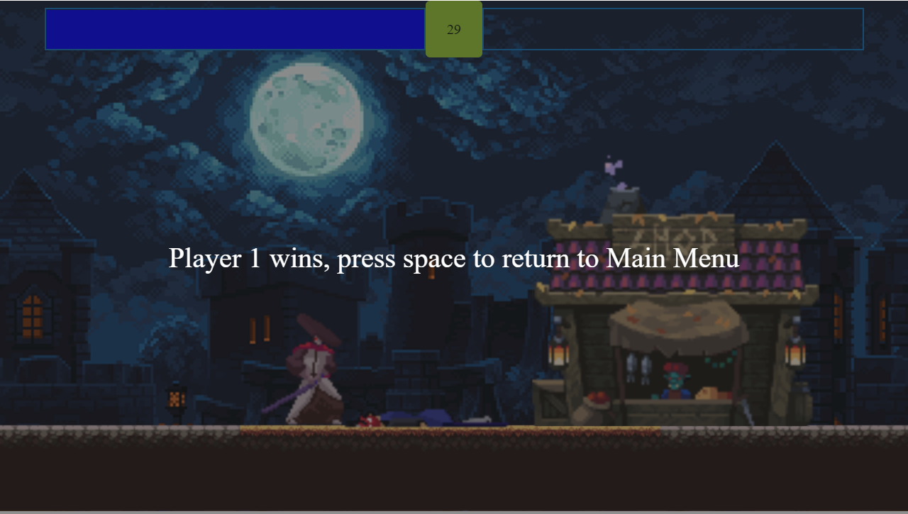
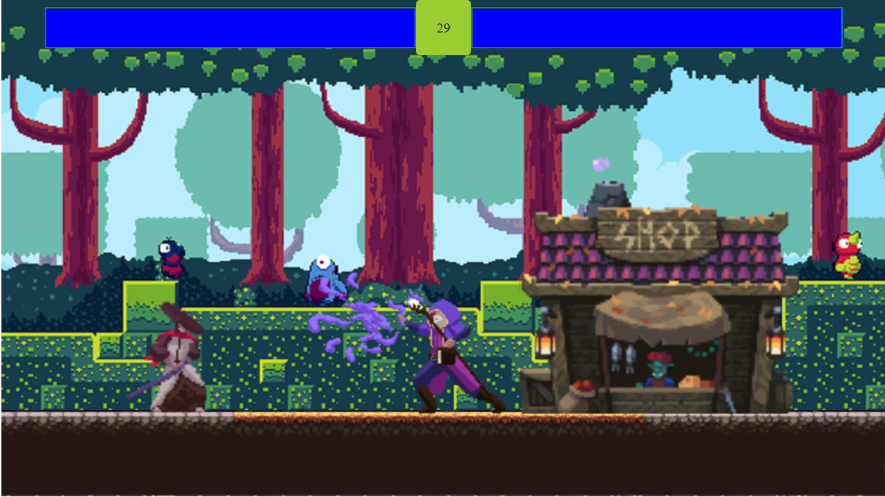
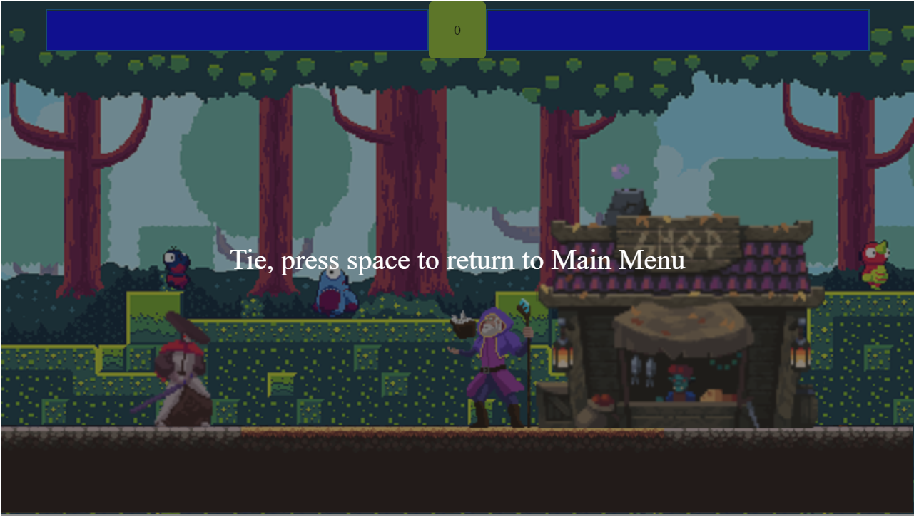
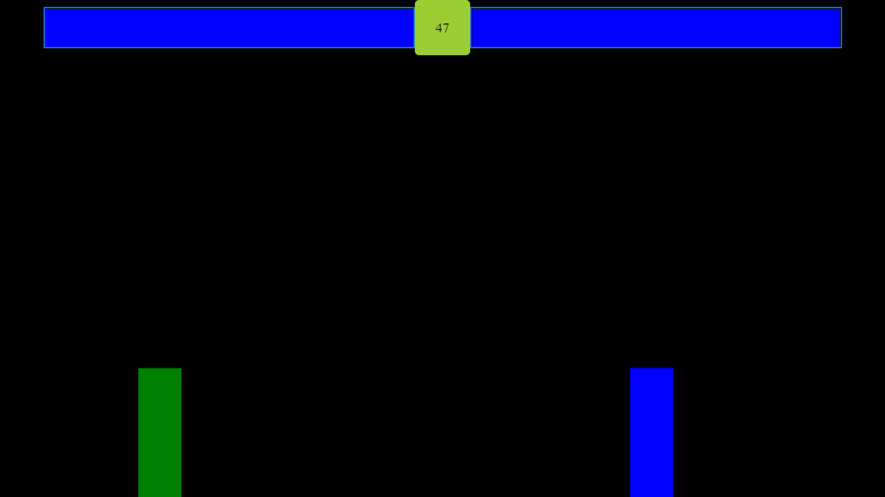
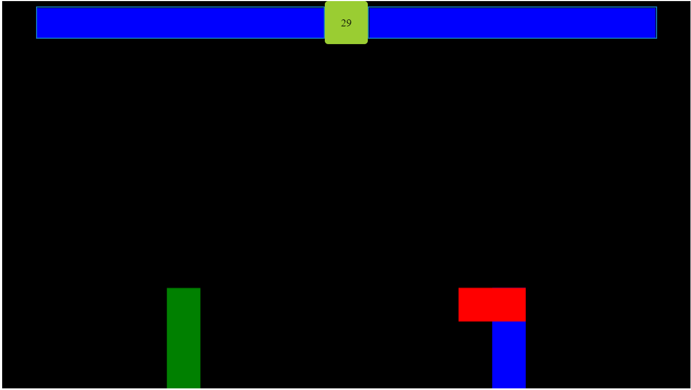
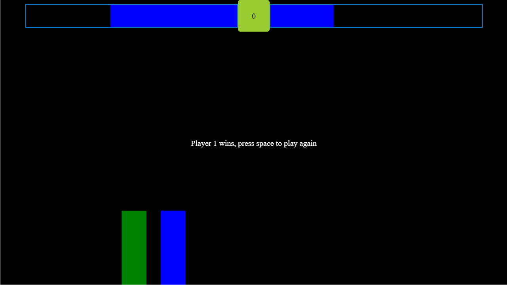

# Fighting game project
This project consist of 2 games:
- prototype game demonstrating the game mechanics;
- completed game with a menu where you can select from 3 available fighters and 3 stages.

Game controls:
- player 1: **w,a,s,d keys** for movement, **j key** for attack
- player 2: **arrow keys** for movement, **1 key** for attack

The project was build using vanilla JavaScript and canvas
<table style="padding:10px">
	<tr>
		<td colspan="2">Finalized game</td>
	</tr>
	<tr>
		<td></td>
		<td></td>
	</tr>
	<tr>
		<td></td>
		<td></td>
	</tr>
	<tr>
		<td></td>
		<td></td>
	</tr>
	<tr>
		<td colspan="2">Prototype game</td>
	</tr>
	<tr>
		<td></td>
		<td></td>
	</tr>
	<tr>
		<td></td>
		<td></td>
	</tr>
</table>